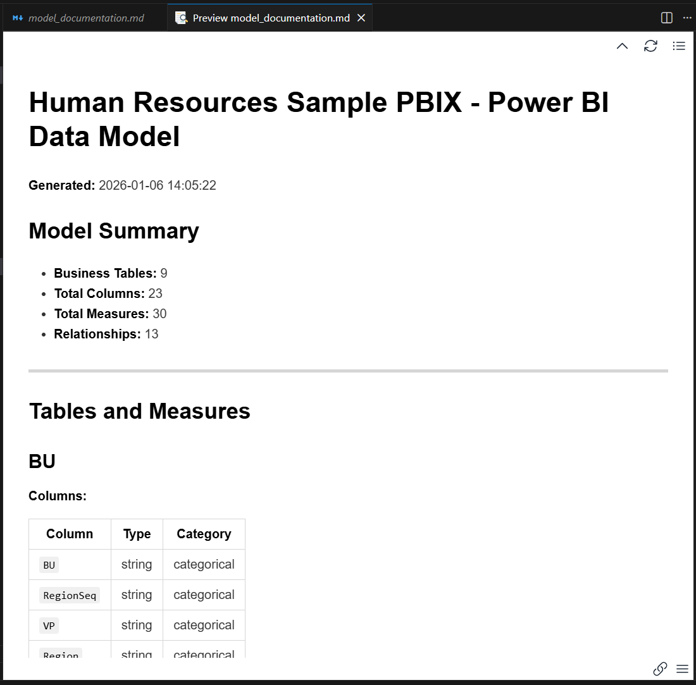
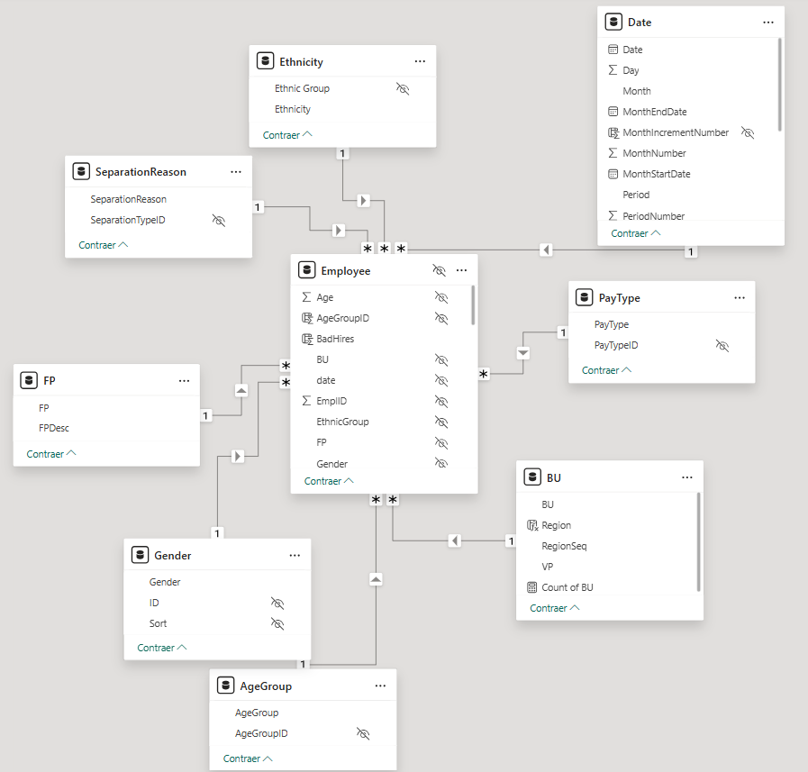
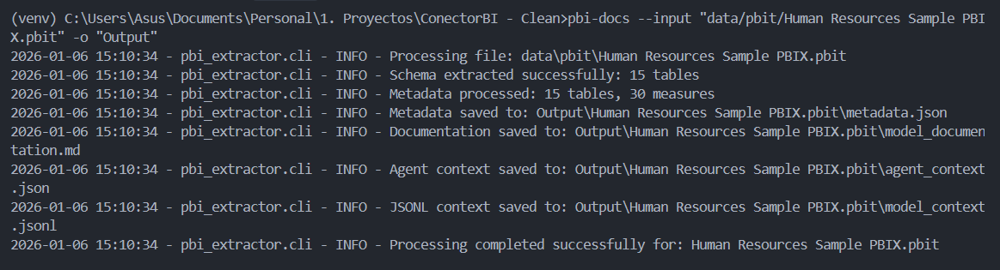
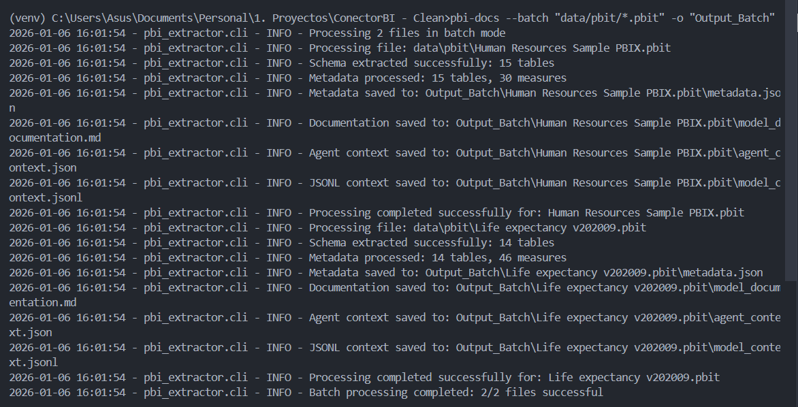
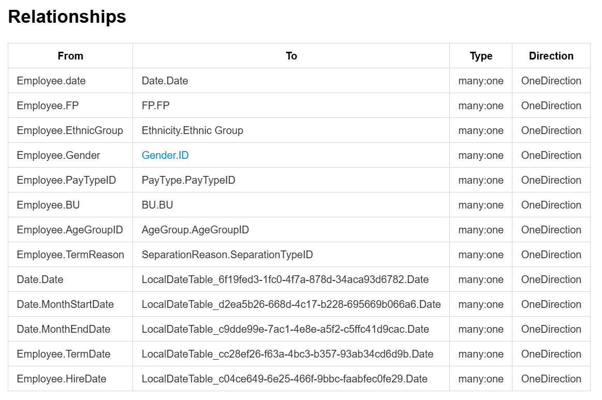
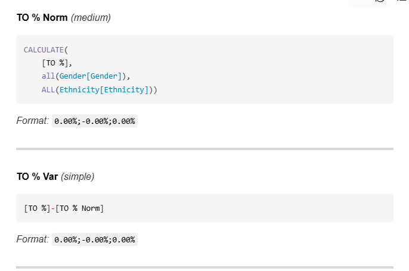

## pbi-docs — Power BI Documentation Generator



[](https://www.python.org/)
[](LICENSE)
[](https://www.microsoft.com/windows)

**Generate complete Power BI model documentation in seconds. Featuring advanced hierarchical DAX formatting and AI-ready context.**

Automatically extract metadata from Power BI `.pbit` files and generate:
- Human-readable Markdown documentation
- AI-optimized JSON/JSONL context for LLMs
- Categorized measures (revenue, cost, margin, etc.)
- **Hierarchical DAX formatting** for maximum readability

No external dependencies. Python-only.

## Why pbi-docs?

| Your Need | pbi-docs Solution |
|-----------|---------------------|
| **Document 10+ dashboards fast** | Batch processing with `--batch` |
| **Train AI agents on your models** | AI-optimized JSONL format |
| **Actually readable DAX** | Hierarchical indentation (4x better than raw) |
| **Zero-cost, zero-install** | Python-only, no .NET dependencies |
| **Compare model versions** | Built-in `--diff` mode |

**Perfect for:** Data engineers onboarding teams, consultants auditing models, organizations building AI copilots for BI.


## Quick Start

```powershell
# 1. Clone the repository
git clone https://github.com/orosero24/pbi-docs.git
cd pbi-docs

# 2. Install the package
pip install -e .

# 3. Generate documentation for a .pbit file
pbi-docs --input "data/pbit/Life expectancy v202009.pbit"

# 4. Review the results (Windows PowerShell)
Get-Content "output/Life expectancy v202009.pbit/model_documentation.md"
```

**Result:** Complete documentation of your Power BI model in seconds. 4 files are generated in the output folder.

## Demo

### Input (Power BI Model)


### CLI Usage


### AI Agent Using the Documentation


---

## Minimal Reproducible Example

> **Note:** The sample files used in this documentation (e.g., "Life expectancy v202009", "Human Resources Sample PBIX") are available from the [Microsoft Power BI Desktop Samples repository](https://github.com/microsoft/powerbi-desktop-samples). These are official sample files provided by Microsoft for learning and testing purposes.

### Step 1: Prepare a .pbit file

If you have a `.pbix` file, export it to `.pbit` from Power BI Desktop:
1. Open your `.pbix` file in Power BI Desktop
2. Go to **File > Export > Power BI Template**
3. Save the `.pbit` file in the `data/pbit/` folder

Alternatively, you can download sample `.pbit` files from the [Microsoft Power BI Desktop Samples repository](https://github.com/microsoft/powerbi-desktop-samples) and export them to `.pbit` format.

### Step 2: Run the extractor

```powershell
# Process the included example file
pbi-docs --input "data/pbit/Life expectancy v202009.pbit"
```

### Step 3: Verify the output

The command generates a folder with the file name in `output/`:

```
output/Life expectancy v202009.pbit/
├── metadata.json              # Structured model metadata
├── model_documentation.md     # Human-readable documentation
├── agent_context.json        # LLM-optimized context
└── model_context.jsonl       # JSONL format for embeddings/RAG
```

### Step 4: Review the documentation

**Expected output example:**

```powershell
# View the model summary
Get-Content "output/Life expectancy v202009.pbit/model_documentation.md" | Select-Object -First 15
```

**Output:**
```markdown
# Life expectancy v202009 - Power BI Data Model

**Generated:** 2025-12-22 14:23:29

## Model Summary

- **Business Tables:** 9
- **Total Columns:** 23
- **Total Measures:** 44
- **Relationships:** 9
```

### Step 5: Use the context for AI

```python
import json

# Load context for AI analysis
with open("output/Life expectancy v202009.pbit/agent_context.json", "r", encoding="utf-8") as f:
    context = json.load(f)
    
print(f"Model: {context['model_name']}")
print(f"Key measures: {len(context['key_measures'])}")
print(f"First measure: {context['key_measures'][0]['name']}")
```

**Expected output:**
```
Model: Life expectancy v202009
Key measures: 20
First measure: Revenue Budget
```

---

## Project Status

- **Implemented (versions 0.1.0–0.2.0, see `CHANGELOG.md`)**
  - CLI `pbi-docs` with modes: single file (`--input/-i`), custom output (`--output/-o`), batch (`--batch`) and model diff (`--diff`), plus verbose mode (`--verbose`).
  - **Multi-language support**: Generate documentation in English (`--lang en`) or Spanish (`--lang es`). English is the default.
  - Robust extraction of `DataModelSchema` from `.pbit` files (`.pbit` only, not direct `.pbix`).
  - Model processing and generation of:
    - `metadata.json`
    - `model_documentation.md`
    - `agent_context.json`
    - `model_context.jsonl`
  - Advanced DAX formatting with hierarchical indentation and complexity classification (Simple/Medium/Complex).
  - Intelligent measure categorization (revenue, cost, margin, percentage, ratio, temporal, calendar, etc.).
  - Python packaging (`pyproject.toml`) with console entry point `pbi-docs`.

- **Planned / In Design (see `[Unreleased]` section in `CHANGELOG.md`)**
  - Support for native `.pbix` files (without exporting to `.pbit`).
  - New CLI options (`--quiet`, `--format`, and other advanced flags).
  - Automated tests with `pytest` and increased validation coverage.
  - PII/sensitive column detection.
  - Automatic ER diagram generation.
  - Export to other formats (PDF, interactive HTML).
  - Future support for other BI engines (Qlik Sense, Tableau), REST API and plugins (VS Code / Power BI Desktop).

## Features

| Feature | Description |
|---------|-------------|
| **Automatic Extraction** | Reads `.pbit` files without additional configuration |
| **Advanced DAX Formatting** | Hierarchical indentation with parenthesis alignment for maximum readability |
| **Intelligent Categorization** | Automatically identifies revenue, cost, temporal columns |
| **Multi-language Support** | Generate documentation in English or Spanish via `--lang` flag |
| **Multi-format Docs** | Generates Markdown (humans) + JSON + JSONL (APIs/agents) |
| **AI-Ready** | Context optimized for Claude, GPT, and other LLMs |
| **Zero Dependencies** | Standard Python only, no external libraries |

---

## Requirements
- Python 3.10+ (3.12 recommended)
- Windows PowerShell (instructions include Windows commands)

Optional: virtual environment (`venv`). No external libraries required.

---

## Installation (Windows/PowerShell)

```powershell
# 1) Clone or download the repository
# 2) (Optional) Create and activate virtual environment
python -m venv venv
./venv/Scripts/Activate.ps1

# 3) Editable installation (development)
pip install -e .

# Verify Python version
python --version
```

If PowerShell blocks activation, run as Administrator:

```powershell
Set-ExecutionPolicy -ExecutionPolicy RemoteSigned -Scope CurrentUser
```

---

## Quick Usage

### Basic Commands

**Process a single file:**
```powershell
pbi-docs --input "data/pbit/Life expectancy v202009.pbit"
```

**Specify custom output directory:**
```powershell
pbi-docs -i "data/pbit/my-model.pbit" -o "my-results"
```

**Process multiple files (batch mode):**
```powershell
pbi-docs --batch "data/pbit/*.pbit"
```



**Compare two versions of a model:**
```powershell
pbi-docs --diff "data/pbit/model_v1.pbit" "data/pbit/model_v2.pbit"
```

**Verbose mode (more debugging information):**
```powershell
pbi-docs --input "data/pbit/my-model.pbit" --verbose
```

**Generate documentation in Spanish:**
```powershell
pbi-docs --input "data/pbit/my-model.pbit" --lang es
```

**Generate documentation in English (default):**
```powershell
pbi-docs --input "data/pbit/my-model.pbit" --lang en
# Or simply omit --lang (English is the default)
pbi-docs --input "data/pbit/my-model.pbit"
```

### Expected Output

When running the command, you'll see messages like:

```
Processing file: data/pbit/Life expectancy v202009.pbit
Schema extracted successfully: 11 tables
Metadata processed: 11 tables, 44 measures
Metadata saved to: output/Life expectancy v202009.pbit/metadata.json
Documentation saved to: output/Life expectancy v202009.pbit/model_documentation.md
Agent context saved to: output/Life expectancy v202009.pbit/agent_context.json
JSONL context saved to: output/Life expectancy v202009.pbit/model_context.jsonl
Processing completed successfully for: Life expectancy v202009.pbit
```

### Important Notes

- **`.pbit` files only:** Currently only `.pbit` files are supported. `.pbix` files must be exported to `.pbit` from Power BI Desktop (File > Export > Power BI Template).
- **Language selection:** Use `--lang en` for English (default) or `--lang es` for Spanish. The language affects the generated `model_documentation.md` and `agent_context.json` files.
- **Paths with spaces:** Use quotes around paths that contain spaces.
- **Recommended paths:** Place your files in `data/` or `data/pbit/` to keep the project organized.

---

## Project Structure

```
pbi-docs/
├── pbi_extractor/           # Main package
│   ├── __init__.py
│   ├── cli.py              # CLI with argparse
│   ├── extractor.py        # Schema extraction with validations
│   ├── processor.py        # Metadata processing
│   ├── formatters.py       # Advanced hierarchical DAX formatting
│   ├── categorizer.py      # Table/measure categorization
│   ├── documentation.py    # Markdown generation
│   ├── diff.py            # Model comparison
│   └── jsonl_generator.py # JSONL generator for LLMs
├── data/                   # Input .pbit files
├── output/                 # Generated results
├── extract_metadata.py     # Standalone script (wrapper)
├── pyproject.toml         # Package configuration
├── README.md
├── CHANGELOG.md
└── LICENSE
```

---

## Generated Outputs

After running the script, a folder is created in `output/` with the input file name. Inside you'll find:

- **`metadata.json`**
  - `summary`: totals of tables, visible columns, visible measures and relationships.
  - `tables`: each table with `columns` (type, visibility, category) and `measures` (clean expression, format, display folder, category).
  - `relationships`: from/to, cardinality, direction and active status.

- **`model_documentation.md`**
  - Model summary (language depends on `--lang` flag, default: English).
  - List of tables (hidden or business), visible columns and measures grouped by category: revenue, cost, margin, percentage, ratio, temporal, etc.
  - Sections with DAX expressions formatted with **hierarchical indentation**.
  - Relationships table with visual representation of table connections.
  - AI Agent Usage Guide with sample questions (translated based on selected language).



- **`agent_context.json`**
  - Model name, totals, available tables, key measures (up to 20), temporal columns and sample questions (language depends on `--lang` flag, default: English).

- **`model_context.jsonl`**
  - Line-delimited JSON format optimized for embeddings and RAG.
  - Each line is an independent object (table, measure or relationship).
  - Includes formatted DAX and sample prompts.

---

## Use Cases

### 1. Automatic Dashboard Documentation

**Problem:** Your company has multiple undocumented Power BI dashboards. Analysts waste time searching for which measures to use and how tables are related.

**Solution:**
```powershell
# Process all dashboards in a folder (English documentation)
pbi-docs --batch "data/dashboards/*.pbit"

# Or generate Spanish documentation for all dashboards
pbi-docs --batch "data/dashboards/*.pbit" --lang es
```


**Result:**
- Each dashboard generates its own documentation in `output/[dashboard-name].pbit/`
- Documentation ready to share with the team
- Automatic identification of measures by category (revenue, cost, margin, etc.)

**Output example:**
```
output/
├── Sales Dashboard.pbit/
│   ├── model_documentation.md  # 23 documented measures
│   └── metadata.json
├── Finance Dashboard.pbit/
│   ├── model_documentation.md  # 31 documented measures
│   └── metadata.json
└── Operations Dashboard.pbit/
    ├── model_documentation.md  # 18 documented measures
    └── metadata.json
```

---

### 2. New Analyst Onboarding

**Problem:** New employees need weeks to understand Power BI model structure and which measures to use for each analysis.

**Solution:**
1. Generate the model documentation (in your preferred language):
```powershell
# English documentation (default)
pbi-docs --input "data/pbit/Life expectancy v202009.pbit"

# Spanish documentation
pbi-docs --input "data/pbit/Life expectancy v202009.pbit" --lang es
```

2. Upload the `model_documentation.md` file to your favorite AI agent (Claude, GPT-4, etc.)

3. The agent can answer questions like:
   - "What revenue measures are available?"
   - "How is Gross Margin calculated?"
   - "What tables are related to Customer?"

**Interaction example:**
```
User: What revenue measures does this model have?

Agent: The "Life expectancy v202009" model has 11 revenue measures:
- Total Revenue (simple): SUM([Revenue])
- YTD Revenue (simple): TOTALYTD(SUM([Revenue]),'Date'[Date])
- Revenue SPLY (medium): CALCULATE([Total Revenue],SAMEPERIODLASTYEAR('Date'[Date]))
- Revenue Budget (medium): CALCULATE([Total Revenue], FILTER(Scenario, Scenario[Scenario]="Budget"))
...
```

**Benefit:** Significant reduction in onboarding time by having immediate answers about the model structure.

---

### 3. Model Auditing

**Problem:** You need to compare two versions of the same dashboard to identify which measures or relationships changed between releases.

**Solution:**
```powershell
# Compare two versions of the model
pbi-docs --diff "data/pbit/dashboard_v1.pbit" "data/pbit/dashboard_v2.pbit"
```

**Result:** A `diff_dashboard_v1_vs_dashboard_v2.json` file is generated with:
- Added measures
- Removed measures
- Modified relationships

**Output example (`diff_*.json`):**
```json
{
  "a_model": "dashboard_v1",
  "b_model": "dashboard_v2",
  "measures_added": [
    ["Fact", "New Revenue Measure"]
  ],
  "measures_removed": [
    ["Fact", "Deprecated Measure"]
  ],
  "relationships_added": [
    ("Fact", "NewKey", "NewTable", "NewKey", "many:one", "OneDirection")
  ],
  "relationships_removed": []
}
```

---

### 4. Integration with AI Agents and RAG

**Problem:** You want to create a RAG (Retrieval-Augmented Generation) system that answers questions about your Power BI models using embeddings.

**Solution:**
```python
import json

# Load JSONL context to create embeddings
context_entries = []
with open("output/Life expectancy v202009.pbit/model_context.jsonl", "r", encoding="utf-8") as f:
    for line in f:
        entity = json.loads(line)
        context_entries.append(entity)

# Each entry is independent and ready for embeddings
for entry in context_entries:
    print(f"Type: {entry['type']}, Title: {entry['title']}")
    if entry['type'] == 'measure':
        print(f"  DAX Expression: {entry['formatted_expression']}")
        print(f"  Complexity: {entry['complexity']}")
```

**Output example:**
```
Type: model, Title: Model: Life expectancy v202009
Type: table, Title: Fact (Hidden)
Type: measure, Title: Total Revenue (revenue)
  DAX Expression: SUM([Revenue])
  Complexity: simple
Type: measure, Title: Revenue SPLY (revenue)
  DAX Expression: CALCULATE(
    [Total Revenue],
    SAMEPERIODLASTYEAR(
    'Date'[Date]))
  Complexity: medium
Type: relationship, Title: Relationship: Fact -> Date
```

**Usage with embeddings:**
- Each JSONL line can be converted to an embedding
- Enables semantic search of measures, tables and relationships
- Ideal for chatbots that answer questions about Power BI models

---

## DAX Formatting Example

The formatter now generates **hierarchical indentation** that reflects the logical structure of expressions:



### Before (unformatted):
```dax
CALCULATE([YTD Gross Margin],SAMEPERIODLASTYEAR(DATESYTD('Date'[Date])))
```

### After (hierarchical formatting):
```dax
CALCULATE(
    [YTD Gross Margin],
    SAMEPERIODLASTYEAR(
        DATESYTD(
            'Date'[Date]
        )
    )
)
```

**Formatting features:**
- Each nesting level increases indentation (+4 spaces)
- Closing parentheses aligned with the start of their function
- Arguments on separate lines for clarity
- Preservation of all original arguments
- Complexity indicators (Simple / Medium / Complex)

---

## Troubleshooting

### Common Errors

**Error decoding `DataModelSchema`**: 
- The script tries `utf-8`, `utf-16` and `latin-1`, plus removes comments/trailing commas. 
- If it fails, `schema_snippet.txt` is saved in the output folder for diagnosis.

**Paths with spaces/special characters**: 
- Use quotes in the CLI: `pbi-docs -i "data/My File.pbit"`
- Prefer paths within `data/`.

**No documentation generated**: 
- Verify that the file contains `DataModelSchema`. 
- If you're using `.pbix`, export to `.pbit` from Power BI Desktop (File > Export > Power BI Template).

**PowerShell blocks venv activation**: 
- Adjust the `ExecutionPolicy` as indicated in installation.

### Verify Installation

Run a quick test with the example file:

```powershell
pbi-docs --input "data/pbit/Life expectancy v202009.pbit"
```

**Expected output:**
```
Processing file: data/pbit/Life expectancy v202009.pbit
Schema extracted successfully: 11 tables
Metadata processed: 11 tables, 44 measures
Metadata saved to: output/Life expectancy v202009.pbit/metadata.json
Documentation saved to: output/Life expectancy v202009.pbit/model_documentation.md
Agent context saved to: output/Life expectancy v202009.pbit/agent_context.json
JSONL context saved to: output/Life expectancy v202009.pbit/model_context.jsonl
Processing completed successfully for: Life expectancy v202009.pbit
```

Then verify that the files were generated correctly:

```powershell
# List generated files
Get-ChildItem "output/Life expectancy v202009.pbit/"

# View a summary of the documentation
Get-Content "output/Life expectancy v202009.pbit/model_documentation.md" | Select-Object -First 10
```

### Common Installation Issues

**Error: "Python not recognized"**
```powershell
# Add Python to PATH or use full path
C:\Python312\python.exe -m pip install -e .
```

**Error: "No module named..."**
This project requires no dependencies. If you see this error, verify your Python version:
```powershell
python --version  # Must be 3.10+
```

**Error: "pbi-docs not recognized"**
```powershell
# Reinstall the package
pip install -e .
# Or use python -m
python -m pbi_extractor.cli --input file.pbit
```

---

## Comparison with Alternatives

| Feature | pbi-docs | Power BI Helper | Dataedo | Manual (DAX Studio) |
|---------|------------|-----------------|---------|---------------------|
| **Free & Open Source** | Yes | No (Paid) | No (Paid) | Yes |
| **Batch Processing** | Yes - Multiple files | No - One at a time | Yes | No |
| **Multi-language Support** | Yes - English & Spanish | No | No | No |
| **AI-Ready Outputs** | Yes - JSON + JSONL | No | Limited | No |
| **Hierarchical DAX** | Yes | Basic | Basic | No - Raw only |
| **No Installation** | Yes - pip install | Limited - Desktop app | Limited - Platform | Yes |
| **Categorization** | Yes - Auto (revenue, cost...) | No - Manual | Yes | No |
| **Version Diff** | Yes - Built-in | No | Yes | No - Manual |

---

## Generated Documentation Example

<details>
<summary>View complete example of model_documentation.md (Life expectancy v202009)</summary>

```markdown
# Life expectancy v202009 - Power BI Data Model

**Generated:** 2025-12-22 14:23:29

## Model Summary

- **Business Tables:** 9
- **Total Columns:** 23
- **Total Measures:** 44
- **Relationships:** 9

---

## Tables and Measures

### Fact *(Hidden Table - Measures Only)*

**Measures:**

##### Revenue Measures

**Total Revenue** *(simple)*

```dax
SUM([Revenue])
```

*Format:* `$#,0;($#,0);$#,0`

---

**YTD Revenue** *(simple)*

```dax
TOTALYTD(
    SUM([Revenue]),
    'Date'[Date])
```

*Format:* `$#,0;($#,0);$#,0`

---

**Revenue SPLY** *(medium)*

```dax
CALCULATE(
    [Total Revenue],
    SAMEPERIODLASTYEAR(
    'Date'[Date]))
```

*Format:* `$#,0;($#,0);$#,0`

##### Margin Measures

**Gross Margin** *(simple)*

```dax
[Total Revenue]-[Total COGS]
```

*Format:* `$#,0;($#,0);$#,0`

##### Percentage Measures

**GM%** *(simple)*

```dax
DIVIDE(
    [Gross Margin],
    [Total Revenue])
```

*Format:* `0.0 %;-0.0 %;0.0 %`

### Date

**Columns:**

| Column | Type | Category |
|--------|------|----------|
| `Date` | dateTime | temporal |
| `Year` | int64 | numeric |
| `Month` | string | categorical |

### Customer

**Columns:**

| Column | Type | Category |
|--------|------|----------|
| `Name` | string | descriptive |
| `City` | string | categorical |
| `State` | string | categorical |
| `Country/Region` | string | categorical |

## Relationships

| From | To | Type | Direction |
|------|----|----- |-----------|
| Fact.BU Key | BU.BU Key | many:one | OneDirection |
| Fact.YearPeriod | Date.YearPeriod | many:one | OneDirection |
| Fact.Customer Key | Customer.Customer | many:one | OneDirection |
```

</details>

---

## Contributing

Contributions are welcome! If you'd like to contribute:

1. Fork the repository
2. Create a feature branch (`git checkout -b feature/amazing-feature`)
3. Commit your changes (`git commit -m 'Add amazing feature'`)
4. Push to the branch (`git push origin feature/amazing-feature`)
5. Open a Pull Request

**Bug reports and feature requests:** Please use [GitHub Issues](https://github.com/orosero24/pbi-docs/issues)

---

## Roadmap (ideas)
- Robust support for unpackaged `.pbix` files.
- Inclusion of column/measure descriptions if they exist in the model.
- Automated tests and schema validations.
- Relationship diagram generation (ER diagrams).
- Automatic detection of sensitive/PII columns.
- Export to other formats (PDF, interactive HTML).

---

## Sample Files

The example files referenced in this documentation (such as "Life expectancy v202009" and "Human Resources Sample PBIX") are official sample files provided by Microsoft. You can find these and other Power BI sample files in the [Microsoft Power BI Desktop Samples repository](https://github.com/microsoft/powerbi-desktop-samples).

These sample files are excellent for:
- Testing pbi-docs functionality
- Learning Power BI data modeling
- Exploring different DAX patterns and measure types
- Understanding relationship structures

To use these samples:
1. Clone or download the repository: `git clone https://github.com/microsoft/powerbi-desktop-samples.git`
2. Open the `.pbix` files in Power BI Desktop
3. Export them as `.pbit` files (File > Export > Power BI Template)
4. Use them with pbi-docs to generate documentation

---

## Author

**Oscar Rosero** - Data Engineer | BI Developer

- 💼 [LinkedIn](https://linkedin.com/in/oscrosero24)
- 🐙 [GitHub](https://github.com/orosero24)
- 📧 orosero2405@gmail.com

Built with ❤️ for the Power BI community.

---

## Star History

If this tool saves you time, please consider giving it a ⭐ on GitHub!


