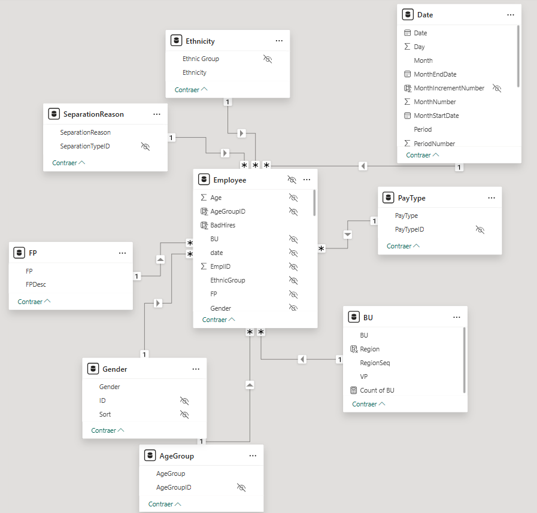
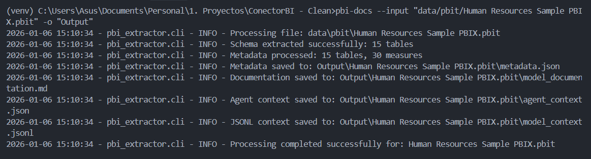
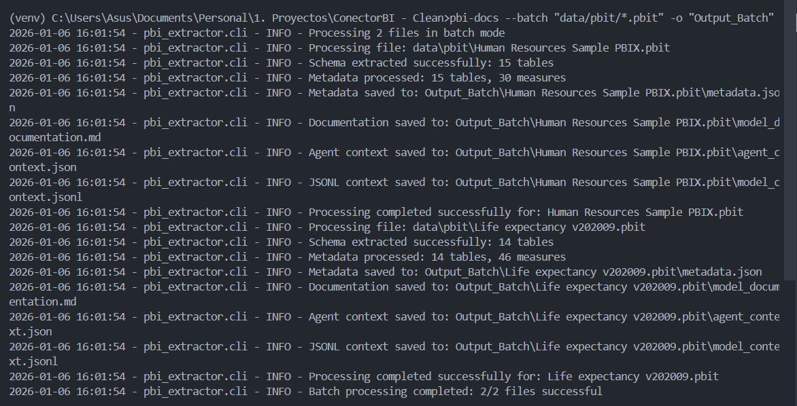
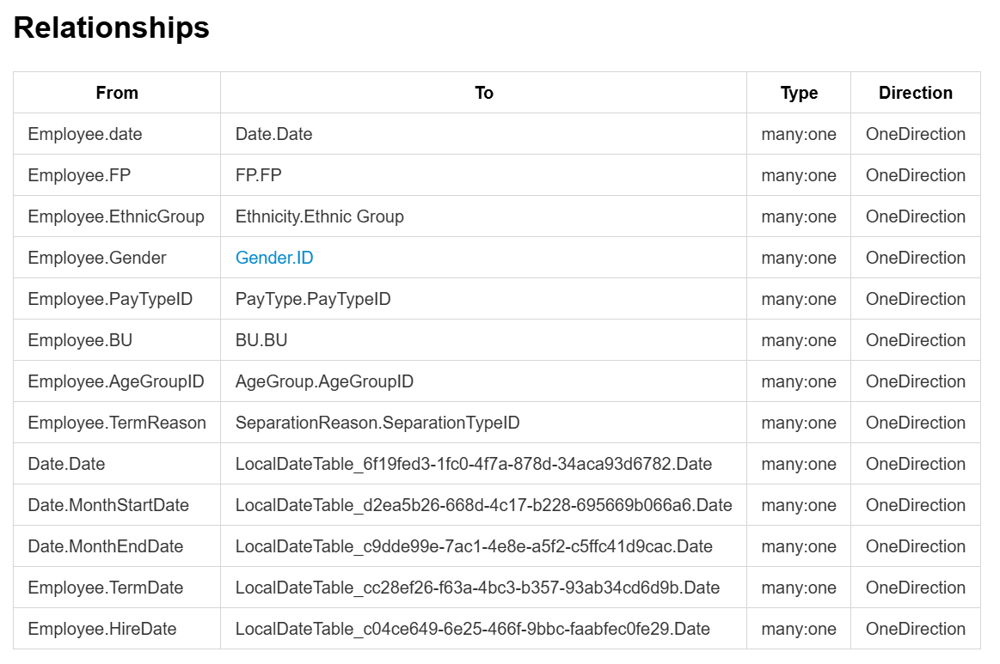
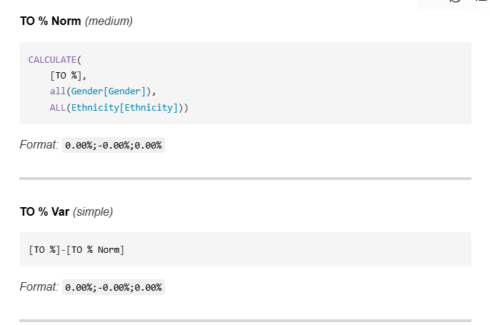

## pbi-docs — AI Context Engine for Power BI Models

[](https://pypi.org/project/pbi-docs/)
[](https://github.com/Osc2405/pbi-docs/actions/workflows/tests.yml)
[](https://www.python.org/)
[](LICENSE)
[](https://github.com/Osc2405/pbi-docs/actions/workflows/tests.yml)

**Turns a Power BI model (`.pbit` or the new `.pbip`/TMDL format) into documentation and
context an AI agent can actually use** — human-readable Markdown, indexed JSON for LLMs/RAG, a
query CLI, and a read-only MCP server. Zero external dependencies.

**Who it's for:** data engineers documenting dashboards, consultants auditing models they didn't
build, and anyone connecting an AI agent (Claude, GPT, Copilot) to a Power BI model's structure.

### Demo





## Quick Start

```powershell
pip install pbi-docs

# From a .pbit file...
pbi-docs --input "data/pbit/my-model.pbit"
# ...or a PBIP project (folder, .pbip marker, or .SemanticModel/ — auto-detected)
pbi-docs --input "data/pbip/my-model/"

Get-Content "output/my-model.pbit/model_documentation.md"
```

**Result:** 7 files in `output/<model-name>/` in seconds — human-readable Markdown, JSON/JSONL
context for AI agents, and an indexed, queryable version for large models.

<details>
<summary><strong>Full walkthrough</strong> — folder structure, expected output, and using the context in Python</summary>

The command generates a folder in `output/` with all documentation files:

```
output/my-model.pbit/          (or output/my-model/ for PBIP)
├── metadata.json              # Structured model metadata
├── model_documentation.md     # Human-readable documentation
├── agent_context.json         # LLM-optimized context (top-20 measures)
├── model_context.jsonl        # JSONL format for embeddings/RAG
├── index.json                 # Lightweight index + pointers
├── relationships.json         # All relationships
└── tables/
    ├── Sales.json             # Full detail per table
    └── ...
```

```powershell
Get-Content "output/my-model.pbit/model_documentation.md" | Select-Object -First 15
```
```markdown
# my-model - Power BI Data Model

**Generated:** 2025-12-22 14:23:29

## Model Summary

- **Business Tables:** 9
- **Total Columns:** 23
- **Total Measures:** 44
- **Relationships:** 9
```

Use the JSON context directly in Python (or point an AI agent at it via `--query` or
`--mcp-serve` — see [Use Cases](#use-cases) below):

```python
import json

with open("output/my-model.pbit/agent_context.json", "r", encoding="utf-8") as f:
    context = json.load(f)

print(f"Model: {context['model_name']}")
print(f"Key measures: {len(context['key_measures'])}")
print(f"First measure: {context['key_measures'][0]['name']}")
```
```
Model: my-model
Key measures: 20
First measure: Revenue Budget
```

</details>

## Why pbi-docs?

| Your Need | pbi-docs Solution |
|-----------|---------------------|
| **Document 10+ dashboards fast** | Batch processing with `--batch` |
| **Support the new PBIP format** | Full TMDL parser, auto-detected from `.pbip` or folder |
| **Train AI agents on your models** | Indexed JSON/JSONL context, a query CLI, and an MCP server |
| **Let an AI agent query the model live** | Read-only MCP server (`--mcp-serve`) — validated against a test harness, not yet a live MCP client, see [MCP server](docs/use-cases.md#7-mcp-server---mcp-serve) |
| **Use it from your AI coding assistant** | Chat-invocable Skill for Claude Code + prompt file for GitHub Copilot |
| **Actually readable DAX** | Hierarchical indentation (4x better than raw) |
| **Compare model versions** | Content-aware `--diff`, with impact analysis (`--diff-impact`) |
| **See the model at a glance** | Embedded Mermaid ER diagram in `model_documentation.md` — renders natively on GitHub/VS Code |
| **Visualize the model in Gephi/yEd** | `--export-graph` — JSON node/edge lists or GraphML |
| **Zero-cost, zero-install** | Python-only, no .NET dependencies |

**Perfect for:** Data engineers onboarding teams, consultants auditing models, organizations building AI copilots for BI.

## Project Status

The read/context layer — PBIP/TMDL support, indexed output, query resolver, MCP server — is
implemented and tested (222 tests). Every claim above is backed by a dated, reproducible report,
not just asserted: see [Validation](#validation) below. Writing/editing TMDL models and PBIR/report-
layer parsing are deliberately out of scope for now (see `CHANGELOG.md` and the
[Roadmap](#roadmap) for why).

## Requirements
- Python 3.10+ (3.12 recommended)
- Windows PowerShell (instructions include Windows commands)

Optional: virtual environment (`venv`). No external libraries required.

## Installation (Windows/PowerShell)

Just want to run `pbi-docs`? `pip install pbi-docs` (see Quick Start above) is all you need. The
steps below are for working on `pbi-docs` itself (editable install from a local clone).

```powershell
# 1) Clone or download the repository
# 2) (Optional) Create and activate virtual environment
python -m venv venv
./venv/Scripts/Activate.ps1

# 3) Editable installation (development)
pip install -e .

# Verify Python version
python --version
```

If PowerShell blocks activation, run as Administrator:

```powershell
Set-ExecutionPolicy -ExecutionPolicy RemoteSigned -Scope CurrentUser
```

---

## Quick Usage

### Basic Commands

**Process a `.pbit` file:**
```powershell
pbi-docs --input "data/pbit/my-model.pbit"
```

**Process a PBIP project (new in v1.0):**
```powershell
# From the .pbip marker file
pbi-docs --input "data/pbip/my-model.pbip"

# From the .SemanticModel folder directly
pbi-docs --input "data/pbip/my-model.SemanticModel"

# From the project root folder (auto-detected)
pbi-docs --input "data/pbip/my-model/"
```

**Specify custom output directory:**
```powershell
pbi-docs -i "data/pbit/my-model.pbit" -o "my-results"
```

**Process multiple files (batch mode — mixed formats supported):**
```powershell
pbi-docs --batch "data/pbit/*.pbit"
```



**Compare two versions of a model (mixed `.pbit`/`.pbip` supported):**
```powershell
pbi-docs --diff "data/pbit/model_v1.pbit" "data/pbip/model_v2/"
```

**Verbose mode (more debugging information):**
```powershell
pbi-docs --input "data/pbit/my-model.pbit" --verbose
```

**Human-readable indexed output (indented JSON, for debugging — compact by default):**
```powershell
pbi-docs --input "data/pbit/my-model.pbit" --pretty
```

**Generate documentation in Spanish:**
```powershell
pbi-docs --input "data/pbit/my-model.pbit" --lang es
```

**Generate documentation in English (default):**
```powershell
pbi-docs --input "data/pbit/my-model.pbit" --lang en
# Or simply omit --lang (English is the default)
pbi-docs --input "data/pbit/my-model.pbit"
```

### Expected Output

When running the command, you'll see messages like:

```
Processing file: data/pbit/my-model.pbit
Schema extracted successfully: 11 tables
Metadata processed: 11 tables, 44 measures
Metadata saved to: output/my-model.pbit/metadata.json
Documentation saved to: output/my-model.pbit/model_documentation.md
Agent context saved to: output/my-model.pbit/agent_context.json
JSONL context saved to: output/my-model.pbit/model_context.jsonl
Processing completed successfully for: my-model.pbit
```

### Important Notes

- **Supported formats:** `.pbit` files (ZIP + JSON TMSL) and `.pbip` projects (TMDL folder structure). `.pbix` files must be exported to `.pbit` from Power BI Desktop (File > Export > Power BI Template).
- **PBIP entry points:** The `--input` flag accepts a `.pbip` marker file, a `.SemanticModel/` folder, or a project root folder. Format is auto-detected.
- **Microsoft Fabric semantic models:** Fabric uses the same TMDL format as PBIP, so compatibility is *expected* but **not empirically validated** (no real Fabric export has been tested against this parser yet) — see [docs/fabric_compatibility.md](docs/fabric_compatibility.md).
- **Language selection:** Use `--lang en` for English (default) or `--lang es` for Spanish. The language affects the generated `model_documentation.md` and `agent_context.json` files.
- **Paths with spaces:** Use quotes around paths that contain spaces.
- **Recommended paths:** Place your files in `data/` or `data/pbit/` to keep the project organized.

---

## Project Structure

```
pbi-docs/
├── pbi_extractor/           # Main package
│   ├── __init__.py
│   ├── cli.py              # CLI with argparse (auto-detection, --index-format)
│   ├── extractor.py        # .pbit (ZIP+JSON TMSL) extractor
│   ├── pbip_extractor.py   # .pbip / TMDL extractor (new in v1.0)
│   ├── processor.py        # Metadata processing (format-agnostic)
│   ├── indexed_output.py   # index.json + tables/*.json writer (new in v1.0)
│   ├── formatters.py       # Advanced hierarchical DAX formatting
│   ├── categorizer.py      # Table/measure categorization
│   ├── documentation.py    # Markdown generation
│   ├── diff.py             # Model comparison
│   ├── jsonl_generator.py  # JSONL generator for LLMs
│   └── i18n.py             # Translations (en/es)
├── tests/
│   ├── fixtures/
│   │   └── minimal_pbip/   # TMDL test fixtures (new in v1.0)
│   ├── test_pbip_extractor.py
│   ├── test_cli_detection.py
│   ├── test_indexed_output.py
│   ├── test_categorizer.py
│   ├── test_i18n.py
│   └── test_processor_and_context.py
├── githooks/                # Reference pre-commit hook (docs/pre_commit_hook.md)
├── data/                   # Input model files
├── output/                 # Generated results
├── pyproject.toml          # Package configuration
├── README.md
├── CHANGELOG.md
└── LICENSE
```

---

## Generated Outputs

After running the command, a folder is created in `output/` with the model name. Inside you'll find:

- **`metadata.json`**
  - `summary`: totals of tables, visible columns, visible measures and relationships.
  - `tables`: each table with `columns` (type, visibility, category) and `measures` (clean expression, format, display folder, category).
  - `relationships`: from/to, cardinality, direction and active status.

- **`model_documentation.md`**
  - Model summary (language depends on `--lang` flag, default: English).
  - List of tables (hidden or business), visible columns and measures grouped by category: revenue, cost, margin, percentage, ratio, temporal, etc.
  - Sections with DAX expressions formatted with **hierarchical indentation**.
  - Relationships table with visual representation of table connections.
  - AI Agent Usage Guide with sample questions (translated based on selected language).



- **`agent_context.json`**
  - Model name, totals, available tables, key measures (up to 20), temporal columns and sample questions (language depends on `--lang` flag, default: English).

- **`model_context.jsonl`**
  - Line-delimited JSON format optimized for embeddings and RAG.
  - Each line is an independent object (table, measure or relationship).
  - Includes formatted DAX and sample prompts.

- **`index.json`** *(new in v1.0)*
  - Lightweight model summary with per-table metadata (column/measure counts, categories) and relative paths to all other output files.
  - Allows LLM agents to navigate large models without loading the full `metadata.json`.

- **`relationships.json`** *(new in v1.0)*
  - All model relationships in a single focused file.

- **`tables/<TableName>.json`** *(new in v1.0)*
  - Full detail for one table (columns + measures including DAX).
  - One file per table, addressable via `index.json`.

---

## `index.json` — open format specification

`index.json` is a small, stable contract meant to be consumed directly by any tool — not just
pbi-docs' own CLI/resolver/MCP server: a lightweight per-table summary (name, column/measure
counts, categories, format, and a relative path to that table's detail file) plus pointers to
every other output file, so an agent can navigate a large model without loading `metadata.json`.
By default it's written **compact** (no indentation); pass `--pretty` for indented JSON.

Full field-by-field contract — top-level shape, per-table entry, the `tables/<Name>.json` JSON vs.
TOON shapes, and the versioning policy — is documented in
**[docs/index-json-spec.md](docs/index-json-spec.md)**.

---

## Use Cases

### 1. Automatic Dashboard Documentation

**Problem:** Your company has multiple undocumented Power BI dashboards. Analysts waste time searching for which measures to use and how tables are related.

**Solution:**
```powershell
# Process all dashboards in a folder (English documentation)
pbi-docs --batch "data/dashboards/*.pbit"

# Or generate Spanish documentation for all dashboards
pbi-docs --batch "data/dashboards/*.pbit" --lang es
```


**Result:**
- Each dashboard generates its own documentation in `output/[dashboard-name].pbit/`
- Documentation ready to share with the team
- Automatic identification of measures by category (revenue, cost, margin, etc.)

**Output example:**
```
output/
├── Sales Dashboard.pbit/
│   ├── model_documentation.md  # 23 documented measures
│   └── metadata.json
├── Finance Dashboard.pbit/
│   ├── model_documentation.md  # 31 documented measures
│   └── metadata.json
└── Operations Dashboard.pbit/
    ├── model_documentation.md  # 18 documented measures
    └── metadata.json
```

---

### 2. New Analyst Onboarding

**Problem:** New employees need weeks to understand Power BI model structure and which measures to use for each analysis.

**Solution:**
1. Generate the model documentation (in your preferred language):
```powershell
# English documentation (default)
pbi-docs --input "data/pbit/my-model.pbit"

# Spanish documentation
pbi-docs --input "data/pbit/my-model.pbit" --lang es
```

2. Upload the `model_documentation.md` file to your favorite AI agent (Claude, GPT-4, etc.)

3. The agent can answer questions like:
   - "What revenue measures are available?"
   - "How is Gross Margin calculated?"
   - "What tables are related to Customer?"

**Interaction example:**
```
User: What revenue measures does this model have?

Agent: The "my-model" model has 11 revenue measures:
- Total Revenue (simple): SUM([Revenue])
- YTD Revenue (simple): TOTALYTD(SUM([Revenue]),'Date'[Date])
- Revenue SPLY (medium): CALCULATE([Total Revenue],SAMEPERIODLASTYEAR('Date'[Date]))
- Revenue Budget (medium): CALCULATE([Total Revenue], FILTER(Scenario, Scenario[Scenario]="Budget"))
...
```

**Benefit:** Significant reduction in onboarding time by having immediate answers about the model structure.

---

### 3. Model Auditing

**Problem:** You need to compare two versions of the same dashboard to identify which measures or relationships changed between releases.

**Solution:**
```powershell
# Compare two versions of the model
pbi-docs --diff "data/pbit/dashboard_v1.pbit" "data/pbit/dashboard_v2.pbit"
```

**Result:** A `diff_dashboard_v1_vs_dashboard_v2.json` file is generated, content-aware — not just
which measures/columns/relationships were added or removed, but which existing ones changed
content (DAX expression, format string, display folder, hidden flag, category, data type,
cardinality, cross-filtering, active flag).

Identity for matching an object across both models:
- Measures and columns: `(table, name)`.
- Relationships: `(from_table, from_column, to_table, to_column)` — a relationship that keeps the
  same connected columns but changes cardinality/cross-filtering/active flag shows up in
  `relationships_modified`, not as a remove+add.

DAX changes are flagged `"semantic"` or `"cosmetic"` via a whitespace-insensitive comparison of
`formatted_expression` — this is a text heuristic (DAX has no whitespace-sensitive syntax, so a
pure reindent compares equal), not a DAX parser; a change to a comment or to non-functional
casing would still register as semantic.

**Output example (`diff_*.json`):**
```json
{
  "a_model": "dashboard_v1",
  "b_model": "dashboard_v2",
  "measures_added": [["Fact", "New Revenue Measure"]],
  "measures_removed": [["Fact", "Deprecated Measure"]],
  "measures_modified": [
    {
      "table": "Fact",
      "name": "Total Sales",
      "changes": {
        "formatted_expression": {"old": "SUM(Fact[Amount])", "new": "SUM(Fact[NetAmount])", "dax_change": "semantic"},
        "display_folder": {"old": "", "new": "Sales"}
      }
    }
  ],
  "columns_added": [],
  "columns_removed": [],
  "columns_modified": [
    {"table": "Fact", "name": "Amount", "changes": {"data_type": {"old": "int64", "new": "decimal"}}}
  ],
  "relationships_added": [],
  "relationships_removed": [],
  "relationships_modified": [
    {
      "from_table": "Fact", "from_column": "DateKey", "to_table": "Date", "to_column": "Date",
      "changes": {"cardinality": {"old": "many:one", "new": "one:one"}}
    }
  ]
}
```

**Impact analysis (`--diff-impact`):** add `--diff-impact` (optionally with `--transitive`) to
also report which measures reference each removed/modified measure **or column** — "what changed,
and what might break" in one call, connecting this diff to the resolver's `find_measure_usages()`
and `find_column_usages()`:

```powershell
pbi-docs --diff "data/pbit/dashboard_v1.pbit" "data/pbit/dashboard_v2.pbit" --diff-impact --transitive
```

```json
{
  "measures_removed_impact": [
    {"table": "Fact", "name": "Deprecated Measure", "used_by": [{"table": "Fact", "name": "Margin %"}]}
  ],
  "measures_modified_impact": [
    {"table": "Fact", "name": "Total Sales", "used_by": [{"table": "Fact", "name": "YTD Sales"}]}
  ],
  "columns_removed_impact": [
    {"table": "Fact", "name": "Discontinued Flag", "used_by": [{"table": "Fact", "name": "Active Sales"}]}
  ],
  "columns_modified_impact": [
    {"table": "Fact", "name": "Amount", "used_by": [{"table": "Fact", "name": "Total Sales"}]}
  ]
}
```
Removed measures/columns are checked for usages in the *old* model (those references just broke);
modified measures/columns are checked in the *new* model (those callers may now behave
differently). The same capability is exposed to AI agents as the `diff_impact` MCP tool (plus a
standalone `find_column_usages` tool) — see
[MCP server](docs/use-cases.md#7-mcp-server---mcp-serve) in docs/use-cases.md.

**Want this enforced automatically before a commit lands?** See
**[docs/pre_commit_hook.md](docs/pre_commit_hook.md)** — a reference `git` pre-commit hook
(under [`githooks/`](githooks/)) for repos that version `.pbip`/`.pbit` models, built on exactly
the command above.

---

More use cases — integrating with AI agents/RAG, chat-invocable Skills for Claude Code and
GitHub Copilot, the `--query` CLI, and the `--mcp-serve` MCP server — are in
**[docs/use-cases.md](docs/use-cases.md)**.

---

## Validation

Every efficiency/correctness claim in this README is backed by a dated, reproducible report
against the real `Supply Chain Sample.pbip` fixture (not a synthetic toy model) — read these
before taking "AI-ready" or "token-optimized" at face value:

- **[docs/pbip_validation_report.md](docs/pbip_validation_report.md)** — end-to-end validation of
  PBIP/TMDL extraction and both output formats against a real (non-synthetic) export; documents
  5 bugs found and fixed in the process.
- **[docs/token_optimization_report.md](docs/token_optimization_report.md)** — measured token
  cost of raw TMDL vs pbi-docs JSON vs TOON across 3 usage scenarios, plus a table-by-table
  breakdown showing TOON is *not* a uniform win (loses on small tables).
- **[docs/precision_validation_report.md](docs/precision_validation_report.md)** — automated
  proxy for the "does scoped context sacrifice accuracy?" question: 3 isolated agents answer 18
  objectively-gradable questions using only raw TMDL / only JSON / only `--query`. JSON and
  `--query` both scored 18/18; raw TMDL scored 16/18 (the 2 misses were honest `NOT_FOUND` on a
  field TMDL doesn't contain at all, not agent error). Includes an honest caveat about total
  conversation token overhead vs. raw context-source bytes.
- **[docs/scale_validation_report.md](docs/scale_validation_report.md)** — behavior at 60
  tables/288 measures (synthetic, since no public enterprise-scale PBIP model exists): confirms
  `--index-format auto` and the resolver still hold up, and is transparent about where a fixed
  per-model cost (`index.json`) stops paying for itself at scale.
- **[docs/human_validation_protocol.md](docs/human_validation_protocol.md)** *(protocol — not yet
  executed)* — the planned human-subject experiment for validating that scoped context doesn't
  cost real users time or accuracy versus raw file dumps.

---

## DAX Formatting Example

The formatter now generates **hierarchical indentation** that reflects the logical structure of expressions:



### Before (unformatted):
```dax
CALCULATE([YTD Gross Margin],SAMEPERIODLASTYEAR(DATESYTD('Date'[Date])))
```

### After (hierarchical formatting):
```dax
CALCULATE(
    [YTD Gross Margin],
    SAMEPERIODLASTYEAR(
        DATESYTD(
            'Date'[Date]
        )
    )
)
```

**Formatting features:**
- Each nesting level increases indentation (+4 spaces)
- Closing parentheses aligned with the start of their function
- Arguments on separate lines for clarity
- Preservation of all original arguments
- Complexity indicators (Simple / Medium / Complex)

---

## Troubleshooting

### Common Errors

**Error decoding `DataModelSchema`**: 
- The script tries `utf-8`, `utf-16` and `latin-1`, plus removes comments/trailing commas. 
- If it fails, `schema_snippet.txt` is saved in the output folder for diagnosis.

**Paths with spaces/special characters**: 
- Use quotes in the CLI: `pbi-docs -i "data/My File.pbit"`
- Prefer paths within `data/`.

**No documentation generated**: 
- Verify that the file contains `DataModelSchema`. 
- If you're using `.pbix`, export to `.pbit` from Power BI Desktop (File > Export > Power BI Template).

**PowerShell blocks venv activation**: 
- Adjust the `ExecutionPolicy` as indicated in installation.

### Verify Installation

Run a quick test with your .pbit file:

```powershell
pbi-docs --input "data/pbit/my-model.pbit"
```

**Expected output:**
```
Processing file: data/pbit/my-model.pbit
Schema extracted successfully: 11 tables
Metadata processed: 11 tables, 44 measures
Metadata saved to: output/my-model.pbit/metadata.json
Documentation saved to: output/my-model.pbit/model_documentation.md
Agent context saved to: output/my-model.pbit/agent_context.json
JSONL context saved to: output/my-model.pbit/model_context.jsonl
Processing completed successfully for: my-model.pbit
```

Then verify that the files were generated correctly:

```powershell
# List generated files
Get-ChildItem "output/my-model.pbit/"

# View a summary of the documentation
Get-Content "output/my-model.pbit/model_documentation.md" | Select-Object -First 10
```

### Common Installation Issues

**Error: "Python not recognized"**
```powershell
# Add Python to PATH or use full path
C:\Python312\python.exe -m pip install -e .
```

**Error: "No module named..."**
This project requires no dependencies. If you see this error, verify your Python version:
```powershell
python --version  # Must be 3.10+
```

**Error: "pbi-docs not recognized"**
```powershell
# Reinstall the package
pip install pbi-docs
# Editable/dev install instead
pip install -e .
# Or use python -m
python -m pbi_extractor.cli --input file.pbit
```

---

## Comparison with Alternatives

| Feature | pbi-docs | Power BI Helper | Dataedo | Manual (DAX Studio) |
|---------|------------|-----------------|---------|---------------------|
| **Free & Open Source** | Yes | No (Paid) | No (Paid) | Yes |
| **Batch Processing** | Yes - Multiple files | No - One at a time | Yes | No |
| **Multi-language Support** | Yes - English & Spanish | No | No | No |
| **AI-Ready Outputs** | Yes - JSON + JSONL | No | Limited | No |
| **Hierarchical DAX** | Yes | Basic | Basic | No - Raw only |
| **No Installation** | Yes - pip install | Limited - Desktop app | Limited - Platform | Yes |
| **Categorization** | Yes - Auto (revenue, cost...) | No - Manual | Yes | No |
| **Version Diff** | Yes - Built-in | No | Yes | No - Manual |
| **MCP Server / On-demand Query** | Yes - Built-in, zero deps | No | No | No |

pbi-docs is a read/context-compilation layer, a different category from Microsoft's own Power BI
MCP servers (Modeling MCP for writes, Remote MCP for DAX execution) — complementary rather than
competing.

---

## Generated Documentation Example

<details>
<summary>View complete example of model_documentation.md (my-model)</summary>

```markdown
# my-model - Power BI Data Model

**Generated:** 2025-12-22 14:23:29

## Tables and Measures

### Fact *(Hidden Table - Measures Only)*

**Measures:**

##### Revenue Measures

**Total Revenue** *(simple)*

```dax
SUM([Revenue])
```

*Format:* `$#,0;($#,0);$#,0`

---

**YTD Revenue** *(simple)*

```dax
TOTALYTD(
    SUM([Revenue]),
    'Date'[Date])
```

*Format:* `$#,0;($#,0);$#,0`

---

**Revenue SPLY** *(medium)*

```dax
CALCULATE(
    [Total Revenue],
    SAMEPERIODLASTYEAR(
    'Date'[Date]))
```

*Format:* `$#,0;($#,0);$#,0`

##### Margin Measures

**Gross Margin** *(simple)*

```dax
[Total Revenue]-[Total COGS]
```

*Format:* `$#,0;($#,0);$#,0`

##### Percentage Measures

**GM%** *(simple)*

```dax
DIVIDE(
    [Gross Margin],
    [Total Revenue])
```

*Format:* `0.0 %;-0.0 %;0.0 %`

### Date

**Columns:**

| Column | Type | Category |
|--------|------|----------|
| `Date` | dateTime | temporal |
| `Year` | int64 | numeric |
| `Month` | string | categorical |

### Customer

**Columns:**

| Column | Type | Category |
|--------|------|----------|
| `Name` | string | descriptive |
| `City` | string | categorical |
| `State` | string | categorical |
| `Country/Region` | string | categorical |

## Relationships

| From | To | Type | Direction |
|------|----|----- |-----------|
| Fact.BU Key | BU.BU Key | many:one | OneDirection |
| Fact.YearPeriod | Date.YearPeriod | many:one | OneDirection |
| Fact.Customer Key | Customer.Customer | many:one | OneDirection |
```

</details>

---

## Contributing

Contributions are welcome! See [CONTRIBUTING.md](CONTRIBUTING.md) for the workflow, or use
[GitHub Issues](https://github.com/Osc2405/pbi-docs/issues) for bug reports and feature requests.

---

## Roadmap

The read/context layer (PBIP/TMDL support, indexed output, query resolver, MCP server) is done.
Writing TMDL models and PBIR/report parsing are deliberately deferred — bigger undertakings, and
(for writing) Microsoft's own Modeling MCP already covers that space.

---

## Sample Files

The example files referenced in this documentation are official sample files provided by Microsoft. You can find these and other Power BI sample files in the [Microsoft Power BI Desktop Samples repository](https://github.com/microsoft/powerbi-desktop-samples).

These sample files are excellent for:
- Testing pbi-docs functionality
- Learning Power BI data modeling
- Exploring different DAX patterns and measure types
- Understanding relationship structures

To use these samples:
1. Clone or download the repository: `git clone https://github.com/microsoft/powerbi-desktop-samples.git`
2. Open the `.pbix` files in Power BI Desktop
3. Export them as `.pbit` files (File > Export > Power BI Template)
4. Use them with pbi-docs to generate documentation

---

## Author

**Oscar Rosero** - Data Engineer | BI Developer

-  [LinkedIn](https://www.linkedin.com/in/oscrosero24/)
-  [GitHub](https://github.com/Osc2405)
-  orosero2405@gmail.com

Built with ❤️ for the Power BI community.

---

## Star History

If this tool saves you time, please consider giving it a ⭐ on GitHub!


